# Hospital Medical Equipment Logistics System

## Submitted by:
- **Student Name 1:** Hananel Kidron ID: 214262305
- **Student Name 2:** Eitan Klein ID: 215013186

**System**: Hospital Management System  
**Selected Unit**: Medical Equipment Logistics Division

## Overview
This project implements a comprehensive PostgreSQL database system for managing hospital logistics operations, with a specific focus on medical equipment and supplies. The system tracks the flow of medical equipment and drugs between departments and warehouses, manages orders, monitors inventory levels, and coordinates logistics personnel activities.

## Table of Contents
- [Database Structure](#database-structure)
- [Entity Relationship Diagram](#entity-relationship-diagram)
- [Entity and Relationship Overview](#entity-and-relationship-overview)
- [Data Population Methods](#data-population-methods)
- [Backup and Restore](#backup-and-restore)
- [Project Structure](#project-structure)
- [Project Phases](#project-phases)

## Database Structure

The database consists of 14 interconnected tables that model the following entities:

1. **Department** - Hospital departments that place orders for medical supplies
2. **Order** - Department requests for medical equipment and drugs
3. **Medical Equipment** - Comprehensive catalog of all medical devices and their specifications, regardless of current inventory status
4. **Drug** - Complete database of all pharmaceutical products that could be ordered by departments, including those not currently in stock
5. **Equipment_order_item** - Details of equipment items in department orders
6. **Drug_order_item** - Details of drug items in department orders
7. **Warehouse** - Storage facilities for medical supplies and equipment
8. **Medical_equipment_warehouse** - Specialized warehouses for medical equipment
9. **Drugs_warehouse** - Specialized warehouses for pharmaceutical products
10. **Equipment_in_stock** - Inventory tracking of equipment in warehouses
11. **Drug_in_stock** - Inventory tracking of drugs in warehouses
12. **Logistic_worker** - Personnel responsible for managing logistics operations
13. **Works_for** - Relationship between logistics workers and departments
14. **Has_access** - Access permissions for logistics workers to warehouses

Each entity contains multiple attributes that describe various aspects of the hospital logistics system, with appropriate relationships established between entities to maintain data integrity and functionality.

## Entity and Relationship Overview

### Warehouse
There are two specialized types of warehouses in the system: **Drug Warehouses** and **Equipment Warehouses**, both inheriting from the base `Warehouse` entity.  
Each type includes attributes relevant to its function, such as cooling capacity, physical dimensions, and daily audit schedules.

### Drug
Represents a single type of drug (not individual units).  
Each drug type can exist in multiple warehouses, in unlimited quantities.  
Within a warehouse, different batches of the same drug are distinguished by the `since` attribute (entry date), allowing for expiration management and FIFO stock handling.

### Medical_Equipment
Represents a single type of medical equipment.  
Like drugs, each equipment type can be stored in multiple warehouses in unlimited quantities.  
There is no differentiation by entry date—only by type and amount.

### Department
Each department in the hospital can submit orders for drugs or equipment.  
Orders cannot exist independently and must be associated with a department.  
This makes `Order` a **weak entity**, fully dependent on the existence of a `Department`.

### Order
An order may include both drug items and equipment items.  
Each order item is uniquely identified by a combination of:
- `Order ID`
- `Department ID`
- `Drug ID` or `Equipment ID`  
This ensures proper tracking of each specific item within a given order.

### Logistic_Worker
A logistic worker may be assigned to multiple departments, and each department may have multiple workers.  
This many-to-many relationship is managed via the `Works_for` table, which includes the number of hours worked in each department.

### Has_Access
This table manages access rights between logistic workers and warehouses.  
Each warehouse can have multiple workers with access, and each worker can access multiple warehouses.  
An optional `level` attribute can represent the level of access or permissions granted.


## Entity Relationship Diagram

The system is designed according to the following Entity-Relationship models:

### Entity Relationship Diagram (ERD)
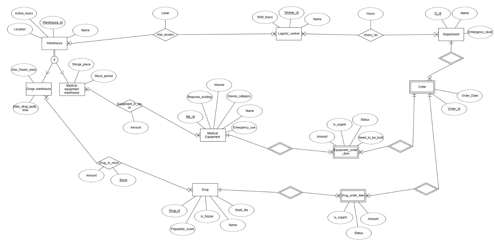

### Data Structure Diagram (DSD)
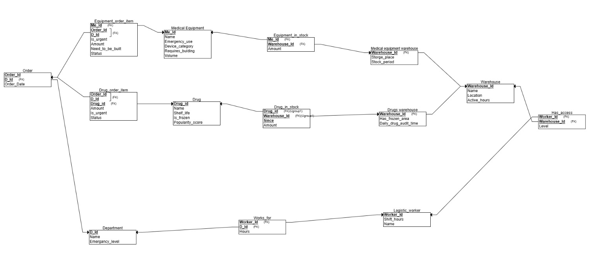

*Note: These diagrams visualize the relationships between all entities in the database system and were created using ERDPlus.*

## Data Population Methods

The database has been populated using three different data insertion methods as required:

### 1. Mockaroo Data Generation

We used Mockaroo to generate structured random data for several tables, including:

#### Drug Table
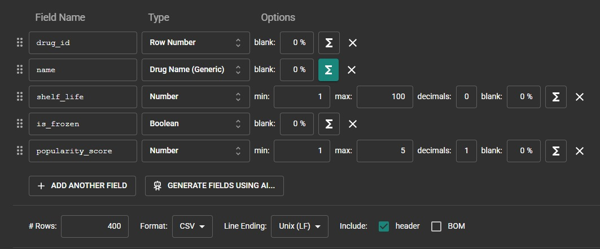
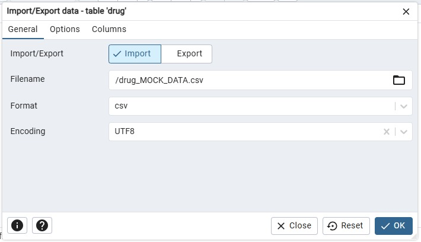
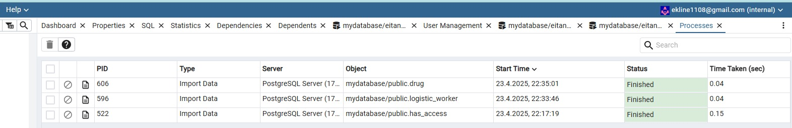

#### Logistic Worker Table
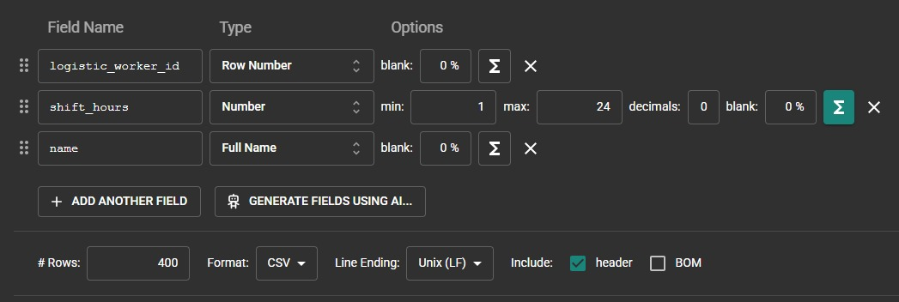
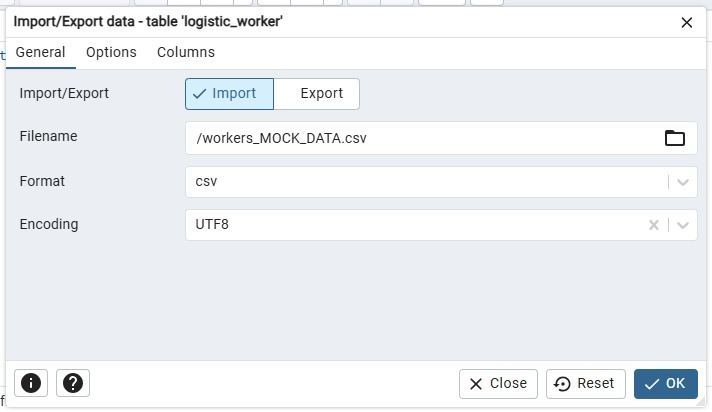


### 2. CSV Import

We imported data directly from prepared CSV files for tables such as Has_access:
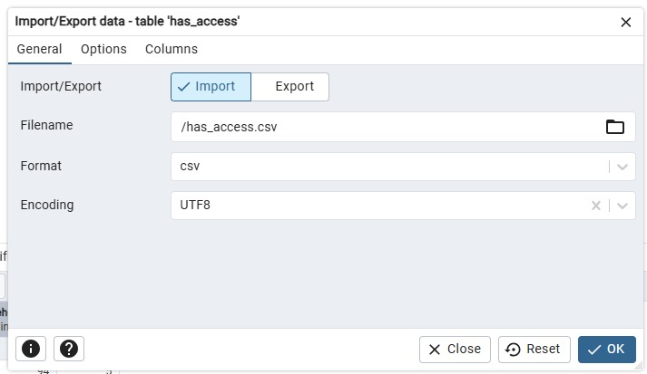
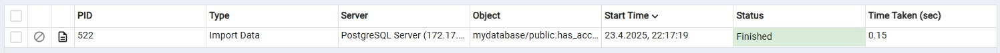

### 3. Python Scripts

We created custom Python scripts to generate data for multiple tables. Our scripts ensure proper relationships between entities and generate the required volume of data (at least 400 records per table).

Python scripts were created for the following tables:
- Department
- Order
- Drug_in_stock
- Drug_order_item
- Equipment_in_stock
- Equipment_order_item
- Medical_equipment
- Medical_equipment_warehouse
- Warehouse
- Works_for
- Drugs_warehouse

## Backup and Restore

### Database Backup

We performed database backup using PostgreSQL's built-in utilities to ensure data preservation.

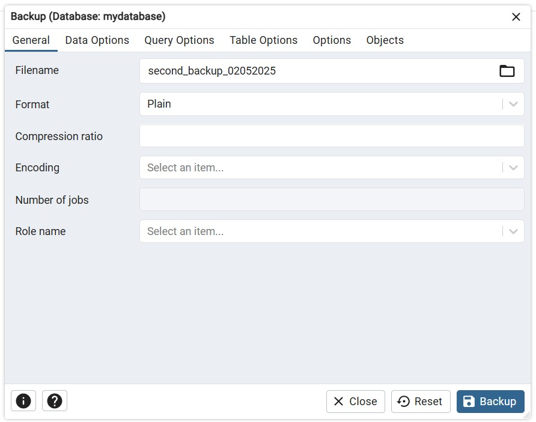

### Database Restoration

We verified the backup integrity by successfully restoring it on a different system:

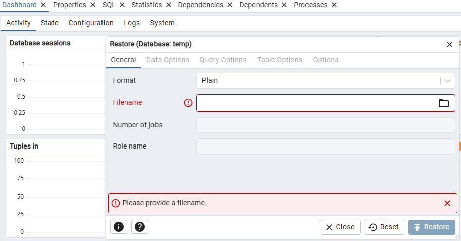
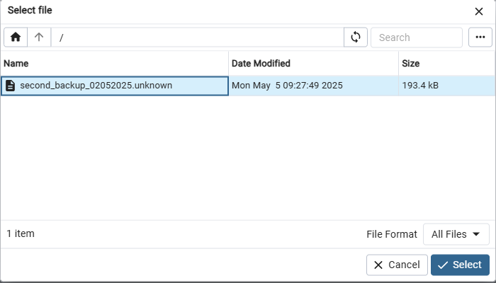
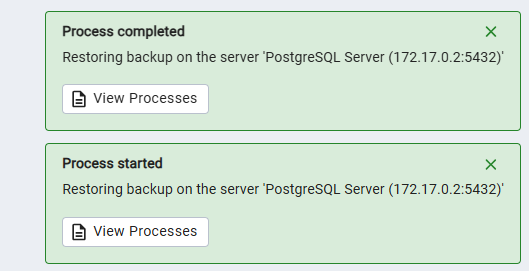

The backup file `second_backup_02052025` was successfully restored, confirming the validity of our backup process.

## Project Structure

The repository is organized as follows:

```
Project Structure:
│
├── README.md
│
└── stage1/
    ├── Backup/
    │   ├── Screenshot_of_the_backup_operation.jpg
    │   ├── Screenshot_of_the_restore_operation1.png
    │   ├── Screenshot_of_the_restore_operation2.png
    │   ├── Screenshot_of_the_restore_operation3.png
    │   └── second_backup_02052025
    │
    ├── Data/
    │   ├── csv_upload/
    │   │   ├── has_access.csv
    │   │   ├── has_access_upload_screen_shot.jpg
    │   │   └── has_access_upload_screen_shot_worked.jpg
    │   │
    │   ├── mockaroo/
    │   │   ├── drug/
    │   │   │   ├── drug_mockaroo_build.jpg
    │   │   │   ├── drug_upload_screen_shot.jpg
    │   │   │   └── general_worked.jpg
    │   │   │
    │   │   └── logistic_worker/
    │   │       ├── general_worked.jpg
    │   │       ├── logistic_worker_mockaroo_build.jpg
    │   │       └── logistic_worker_upload_screen_shot.jpg
    │   │
    │   └── python_scripts/
    │       ├── Department.py
    │       ├── Drugs_warehouse.py
    │       ├── Drug_in_stock.py
    │       ├── Drug_order_item.py
    │       ├── equipment_in_stock.py
    │       ├── equipment_order_item.py
    │       ├── medical_equipment.py
    │       ├── medical_equipment_warehouse.py
    │       ├── Order.py
    │       ├── warehouse.py
    │       └── works_for.py
    │
    ├── ERD_DSD/
    │   ├── DSD.jpg
    │   └── ERD.jpg
    │
    └── Ganeric_actions/
        ├── createTable.sql
        ├── dropTables.sql
        ├── insertTables.sql
        └── selectAll.sql
```

## Project Phases

The project is divided into five phases:

1. **Database Design and Data Population** - Creating the database schema, ERD design, and populating with test data
2. **Query Development** - Creating complex queries to extract meaningful information
3. **Integration and Views** - Developing database views and integration points
4. **PL/pgSQL Programming** - Creating stored procedures and functions
5. **Graphical Interface** - Developing a user interface for the system

Each phase builds upon the previous work, resulting in a fully functional hospital logistics management system.


# Stage 2: SQL Queries, Constraints, and Transaction Management

The second stage of the Hospital Medical Equipment Logistics System project focuses on implementing advanced SQL features, including complex SELECT queries, data modification operations (UPDATE and DELETE), constraints, and transaction management.

## Table of Contents for Stage 2

- [Project Structure](#project-structure-for-stage-2)
- [SELECT Queries](#select-queries)
- [DELETE Operations](#delete-operations)
- [UPDATE Operations](#update-operations)
- [Constraints](#constraints)
- [Transaction Management (ROLLBACK and COMMIT)](#transaction-management)

## Project Structure for Stage 2

```
stage2/
├── Constraints/
│   ├── Constraints.sql
│   ├── DefaultUrgentDrug.jpg
│   ├── DfaultUrgentEq.jpg
│   ├── DrugAmount0.jpg
│   ├── DrugStockDate.jpg
│   ├── EqAmount0.jpg
│   └── NullSinceDrugStock.jpg
│
├── Queries/
│   ├── deleteAllDelivered Orders/
│   │   ├── After.jpg
│   │   ├── Before.jpg
│   │   ├── delete.sql
│   │   └── Done.jpg
│   │
│   ├── deleteExpiredOrders/
│   │   ├── After.jpg
│   │   ├── Before.jpg
│   │   ├── delete.sql
│   │   └── Done.jpg
│   │
│   ├── deleteNoAccessWorkers/
│   │   ├── After.jpg
│   │   ├── Before.jpg
│   │   ├── delete.sql
│   │   └── Done.jpg
│   │
│   ├── selectQueries/
│   │   ├── Employee access to warehouses/
│   │   │   ├── result.jpg
│   │   │   ├── running.jpg
│   │   │   └── select.sql
│   │   │
│   │   ├── For each item, how many warehouses is it located in/
│   │   │   ├── result.jpg
│   │   │   ├── running.jpg
│   │   │   └── select.sql
│   │   │
│   │   ├── Items to pick by warehouse for a specific employee/
│   │   │   ├── result.jpg
│   │   │   ├── running.jpg
│   │   │   └── select.sql
│   │   │
│   │   ├── lack of stock/
│   │   │   ├── result.jpg
│   │   │   ├── running.png
│   │   │   └── select.sql
│   │   │
│   │   ├── Medicines in danger of expiring/
│   │   │   ├── result.jpg
│   │   │   ├── running.jpg
│   │   │   └── select.sql
│   │   │
│   │   ├── The most needed medications/
│   │   │   ├── result.jpg
│   │   │   ├── runnig.jpg
│   │   │   └── select.sql
│   │   │
│   │   ├── Urgent items for each department/
│   │   │   ├── result.png
│   │   │   ├── running.jpg
│   │   │   └── urgentItems.sql
│   │   │
│   │   └── Warehouse inventory summary/
│   │       ├── result.jpg
│   │       ├── running.jpg
│   │       └── select.sql
│   │
│   ├── updateOldUrgent/
│   │   ├── After.jpg
│   │   ├── Before.jpg
│   │   └── update.sql
│   │
│   ├── updatePopularDrugs/
│   │   ├── After.jpg
│   │   ├── Before.jpg
│   │   ├── Done.jpg
│   │   └── update.sql
│   │
│   └── updateUrgentOrders/
│       ├── After.jpg
│       ├── Before.jpg
│       ├── Done.jpg
│       └── update.sql
│
└── RollbackCommit/
    ├── Commit/
    │   ├── Commiting.jpg
    │   ├── CommitingExample.sql
    │   ├── Update.jpg
    │   └── UpdateSaved.jpg
    │
    └── RollBack/
        ├── AfterRollingBack.jpg
        ├── RollingBack.jpg
        ├── RollingExample.sql
        └── Updated.jpg
```

## SELECT Queries

### 1. Urgent Items for Each Department

**שאילתה זו מציגה את מספר הפריטים הדחופים (תרופות וציוד רפואי) בכל מחלקה. היא מסייעת לניהול המשאבים על ידי זיהוי מחלקות הזקוקות לטיפול מיידי. התוצאות מציגות עבור כל מחלקה את מספר פריטי התרופות הדחופים, מספר פריטי הציוד הדחופים והסכום הכולל, מסודר לפי המחלקות עם המספר הגבוה ביותר של פריטים דחופים.**


### 2. The Most Needed Medications

**שאילתה זו מזהה אילו תרופות נדרשות בתדירות הגבוהה ביותר ובכמויות הגדולות ביותר. מידע זה חיוני לניהול מלאי יעיל ולתכנון רכש. התוצאות מציגות עבור כל תרופה את מספר ההזמנות שבהן היא מופיעה וסך כל הכמות שהוזמנה, מסודר לפי הכמות הכוללת בסדר יורד.**


### 3. Lack of Stock

**שאילתה זו מזהה פריטים (תרופות וציוד רפואי) שבהם סך כל הכמות המוזמנת בכל ההזמנות יחד גדולה מסך כל הכמות הזמינה במלאי. עבור כל פריט, היא מחשבת את סך כל הכמות המוזמנת מכל המחלקות ומשווה אותה לסך כל המלאי הזמין בכל המחסנים. התוצאות מציגות את שם הפריט, הכמות שהוזמנה, הכמות הזמינה במלאי וגודל המחסור. התוצאות מסודרות לפי גודל המחסור בסדר יורד, מה שמסייע לניהול הרכש להתמקד תחילה בפריטים עם המחסור החמור ביותר.**


### 4. Warehouse Inventory Summary

**שאילתה זו מספקת סקירה מקיפה של המלאי בכל המחסנים. עבור כל מחסן, היא מציגה את מספר סוגי התרופות וסך הכמות שלהן, או את מספר סוגי הציוד הרפואי וסך הכמות שלו. התוצאות מסודרות לפי הכמות הגדולה ביותר של פריטים במחסן (בין אם מדובר בתרופות או ציוד). שאילתה זו מסייעת בניהול המחסנים, במעקב אחר המלאי ובתכנון הרכש, ומספקת תמונה ברורה של היקף המלאי בכל מחסן.**


### 5. Employee Access to Warehouses

**שאילתה זו מציגה לאילו מחסנים יש לכל עובד לוגיסטיקה גישה. היא מסייעת בתכנון משמרות ובהקצאת משימות לעובדים. התוצאות מציגות עבור כל עובד את מספר המחסנים שיש לו גישה אליהם ואת שמות המחסנים, מסודר לפי העובדים עם הגישה למספר הרב ביותר של מחסנים.**


### 6. Medicines in Danger of Expiring

**שאילתה זו מזהה תרופות שעלולות לפוג בקרוב. היא מסייעת במניעת בזבוז ומבטיחה שהתרופות ישמשו לפני שיפוגו. התוצאות מציגות תרופות שנותר להן פחות מחודש עד לתפוגה, כולל תאריך הכנסתן למלאי, מספר הימים שעברו מאז, אורך חיי המדף שלהן ומספר הימים שנותרו עד לתפוגה.**


### 7. For Each Item, How Many Warehouses Is It Located In

**שאילתה זו מזהה פריטים שנמצאים במספר רב של מחסנים שונים. היא מסייעת בזיהוי פריטים פופולריים שדורשים ניהול מלאי מורכב יותר. התוצאות מציגות עבור כל פריט את מספר המחסנים שבהם הוא נמצא, מסודר לפי המספר הגבוה ביותר של מחסנים.**


### 8. Items to Pick by Warehouse for a Specific Employee

**שאילתה זו מציגה לעובד ספציפי (במקרה זה עובד מספר 1) את כל הפריטים שעליו לאסוף ממחסנים שיש לו גישה אליהם, עבור הזמנות פתוחות של המחלקות שבהן הוא עובד. היא מסייעת לעובד לתכנן את מסלול האיסוף היעיל ביותר. התוצאות מציגות עבור כל מחסן את כל הפריטים לאיסוף, כולל הכמות הנדרשת והכמות הקיימת במלאי.**


## UPDATE Operations

### 1. Update Old Urgent Items

**עדכון של מצב פריט ההזמנה למאושר עבור כל פריטי ההזמנה הדחופים שהוגשו לפני שלושה ימים ולא אושרו (אפשר גם עבור ציוד רפואי)**

שאילתה זו מאשרת באופן אוטומטי פריטי הזמנה דחופים שהוגשו לפני יותר משלושה ימים אך טרם אושרו. פעולה זו מבטיחה שפריטים קריטיים לא נתקעים בתהליך האישור.

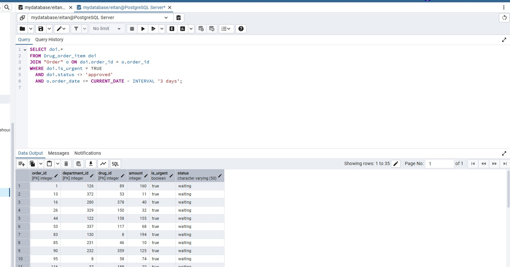


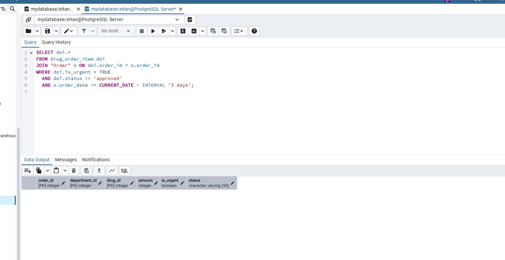

### 2. Update Popular Drugs

**מעלה את כמות התרופה במלאי אוטומטית עבור תרופות פופולריות**

שאילתה זו מגדילה את רמות המלאי עבור תרופות שמוזמנות בתדירות גבוהה. המערכת מגדילה באופן אוטומטי את כמויות המלאי של תרופות שמופיעות במספר רב של הזמנות.

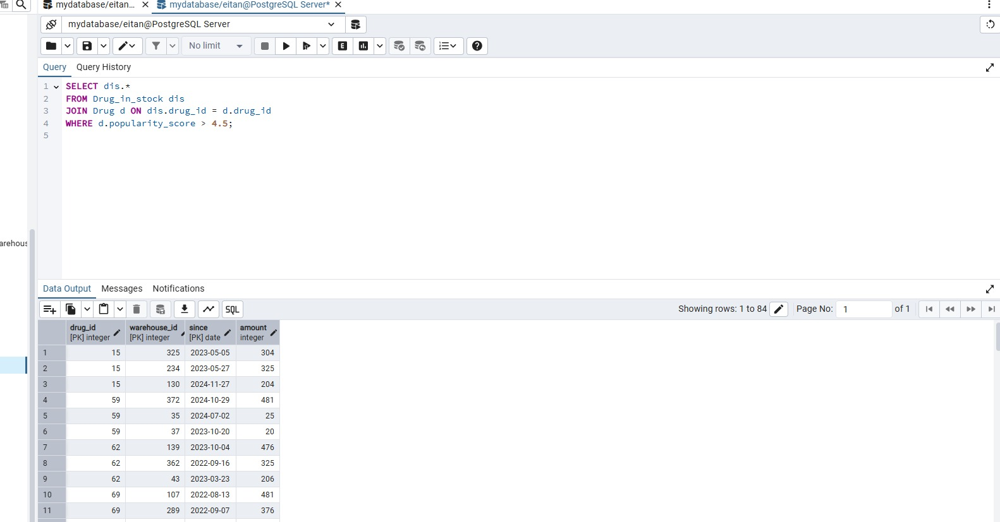


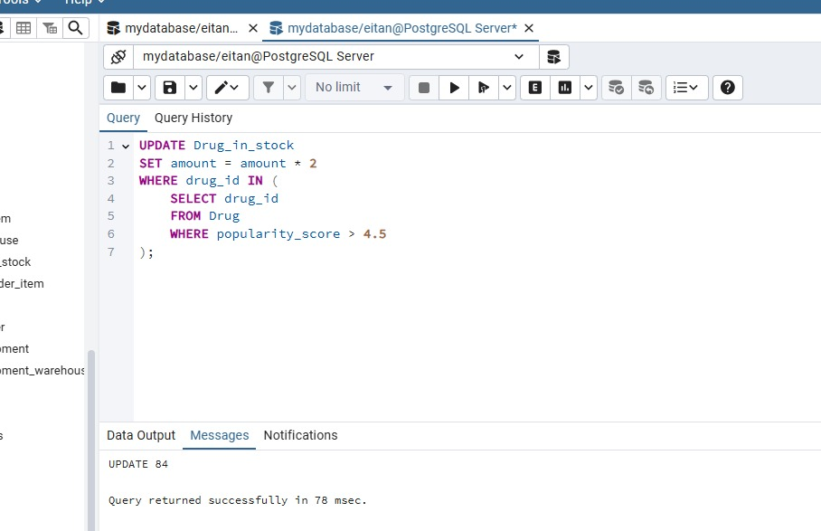

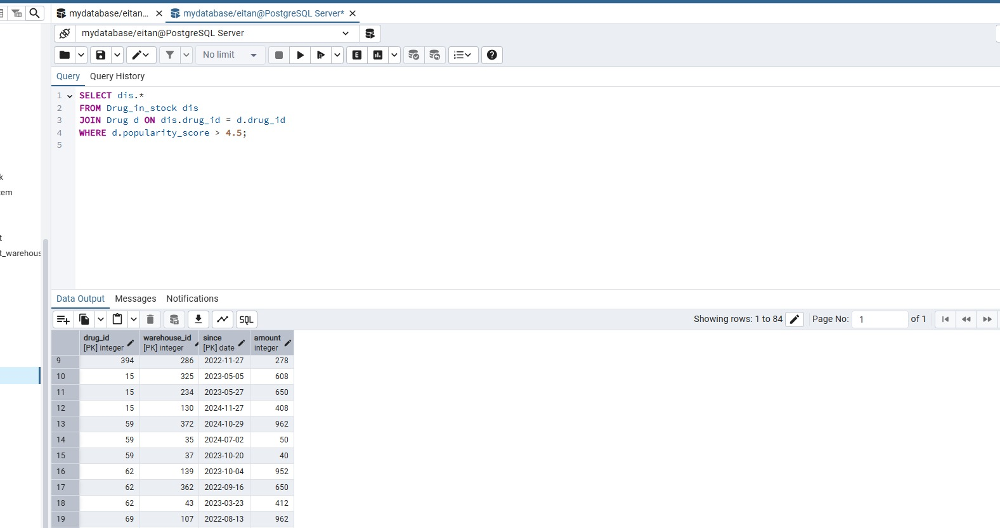

### 3. Update Urgent Orders

**עדכון של מצב פריט ההזמנה למאושר עבור כל פריטי ההזמנה הדחופים שהוגשו על ידי מחלקות דחופות באופן ישיר**

שאילתה זו מאשרת באופן אוטומטי פריטי הזמנה דחופים שהוגשו על ידי מחלקות חירום. פעולה זו מייעלת את תהליך האישור עבור בקשות רגישות לזמן ממחלקות טיפול קריטי.

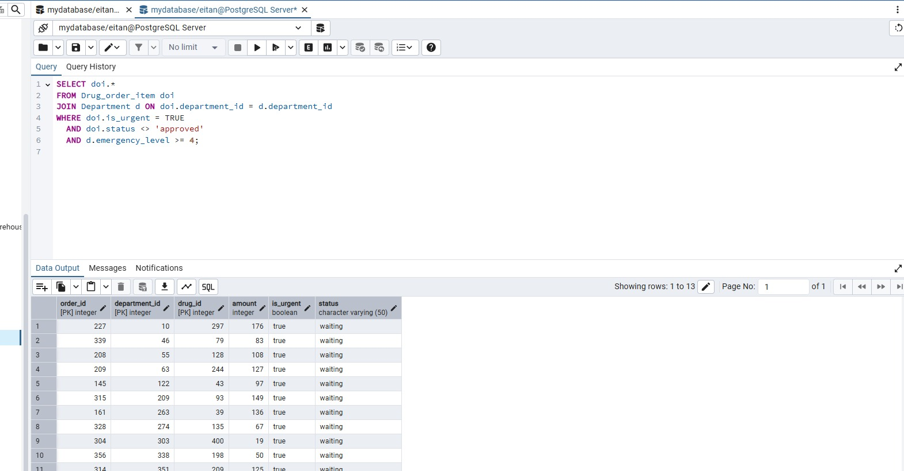


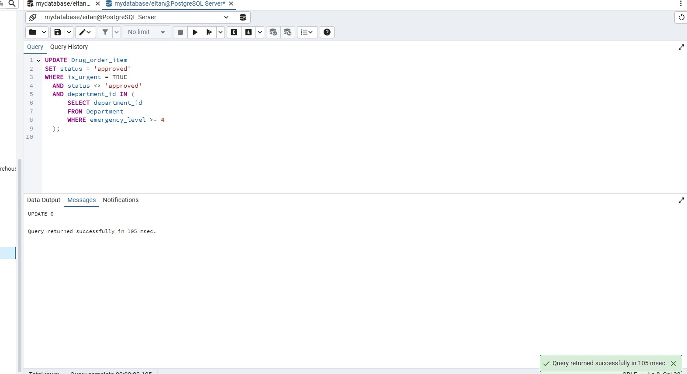

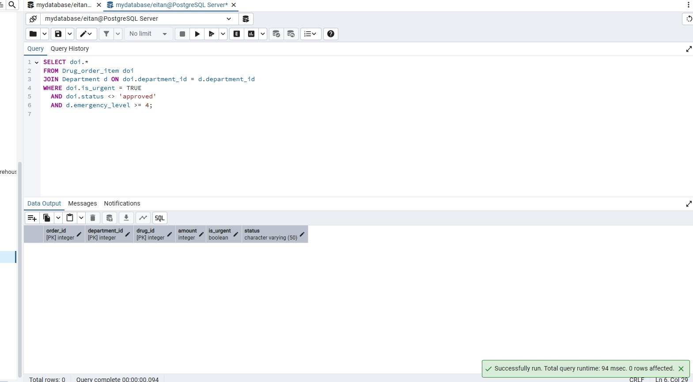.sql)


ס הנתונים לאחר העדכון](.\stage2\Queries\updateOldUrgent\After.jpg)

### 2. Update Popular Drugs

**מעלה את כמות התרופה במלאי אוטומטית עבור תרופות פופולריות**

שאילתה זו מגדילה את רמות המלאי עבור תרופות שמוזמנות בתדירות גבוהה. המערכת מגדילה באופן אוטומטי את כמויות המלאי של תרופות שמופיעות במספר רב של הזמנות כדי להבטיח אספקה מספקת לפריטים בביקוש גבוה.


### 3. Update Urgent Orders

**עדכון של מצב פריט ההזמנה למאושר עבור כל פריטי ההזמנה הדחופים שהוגשו על ידי מחלקות דחופות באופן ישיר**

שאילתה זו מאשרת באופן אוטומטי פריטי הזמנה דחופים שהוגשו על ידי מחלקות חירום. פעולה זו מייעלת את תהליך האישור עבור בקשות רגישות לזמן ממחלקות טיפול קריטי, ומוודאת שהמחלקות הקריטיות ביותר בבית החולים מקבלות שירות מהיר ויעיל.


/deleteAllDelivered%20Orders/delete.sql)


### 2. Delete Expired Orders

**מחיקה של כל ההזמנות (כולל תתי הזמנות) של כל ההזמנות שעברו שבועיים מעת הגשתם**

שאילתה זו מסירה הזמנות שגילן עולה על שבועיים מתאריך ההגשה שלהן. פעולת ניקוי זו מסייעת לשמור על יעילות בסיס הנתונים ומסירה נתונים ישנים שאינם רלוונטיים יותר למערכת.

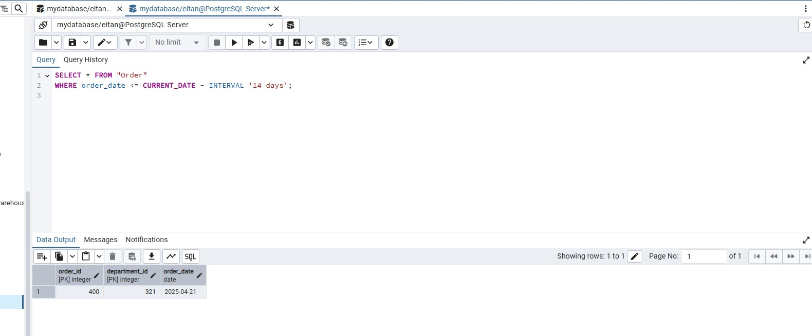


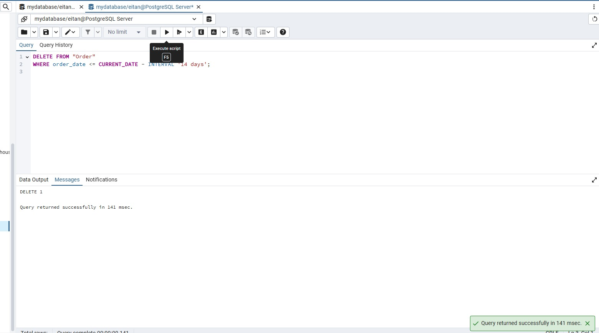

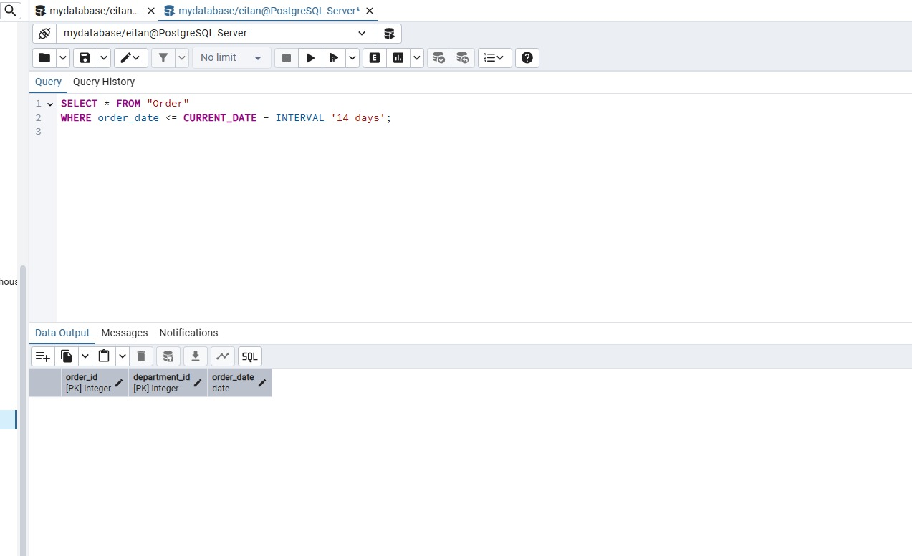

### 3. Delete Workers Without Warehouse Access

**מחיקת כל העובדים ללא גישה לשום מחסן**

שאילתה זו מזהה ומסירה עובדי לוגיסטיקה שאין להם גישה לאף מחסן, שכן הם אינם יכולים לבצע את תפקידם ביעילות ללא גישה כזו. פעולה זו מנקה את מערכת ניהול העובדים ומאפשרת התמקדות בעובדים פעילים.

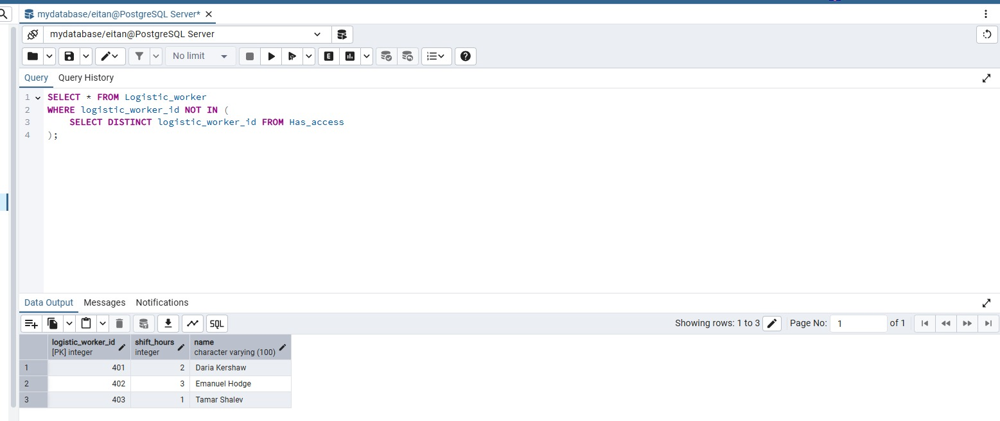


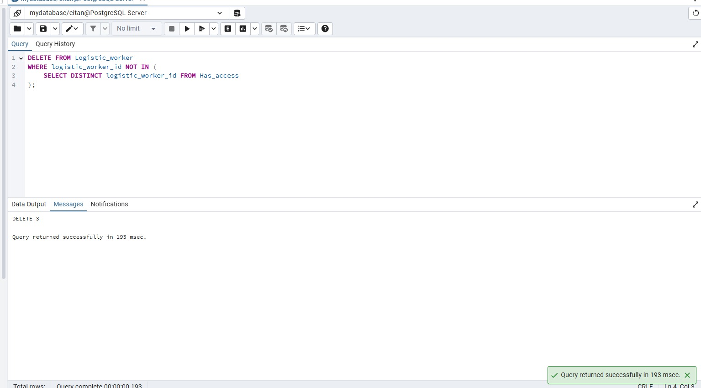

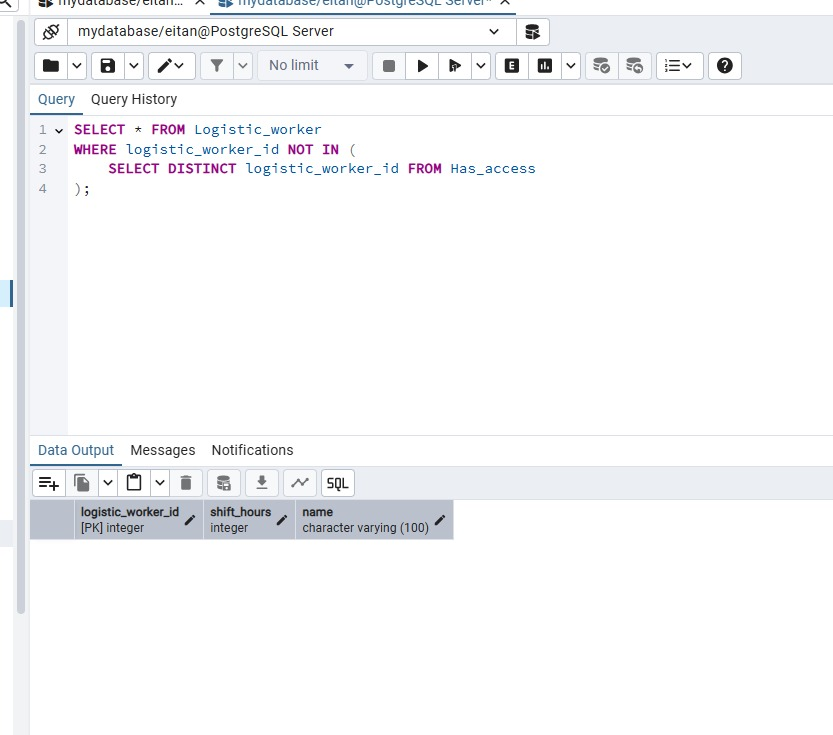

## UPDATE Operations

### 1. Update Old Urgent Items

**עדכון של מצב פריט ההזמנה למאושר עבור כל פריטי ההזמנה הדחופים שהוגשו לפני שלושה ימים ולא אושרו (אפשר גם עבור ציוד רפואי)**

שאילתה זו מאשרת באופן אוטומטי פריטי הזמנה דחופים שהוגשו לפני יותר משלושה ימים אך טרם אושרו. פעולה זו מבטיחה שפריטים קריטיים לא נתקעים בתהליך האישור ומקבלים טיפול גם אם נשכחו.


### 2. Update Popular Drugs

**מעלה את כמות התרופה במלאי אוטומטית עבור תרופות פופולריות**

שאילתה זו מגדילה את רמות המלאי עבור תרופות שמוזמנות בתדירות גבוהה. המערכת מגדילה באופן אוטומטי את כמויות המלאי של תרופות שמופיעות במספר רב של הזמנות כדי להבטיח אספקה מספקת לפריטים בביקוש גבוה.


### 3. Update Urgent Orders

**עדכון של מצב פריט ההזמנה למאושר עבור כל פריטי ההזמנה הדחופים שהוגשו על ידי מחלקות דחופות באופן ישיר**

שאילתה זו מאשרת באופן אוטומטי פריטי הזמנה דחופים שהוגשו על ידי מחלקות חירום. פעולה זו מייעלת את תהליך האישור עבור בקשות רגישות לזמן ממחלקות טיפול קריטי, ומוודאת שהמחלקות הקריטיות ביותר בבית החולים מקבלות שירות מהיר ויעיל.


## Constraints

The database system implements several constraints using ALTER TABLE commands to ensure data integrity and enforce business rules. Each constraint was tested by attempting to insert conflicting data to verify proper error handling.

### 1. Drug Stock Date Validation (chk_since)

**לא ניתן לרשום תרופה שהוכנסה למלאי עם תאריך עתידי (מחר או יותר).**

שינוי זה נעשה באמצעות פקודת ALTER TABLE על טבלת drug_in_stock, שמוסיפה אילוץ CHECK שמוודא שהתאריך בשדה 'since' אינו גדול מהתאריך הנוכחי. כאשר מנסים להכניס רשומה עם תאריך עתידי, המערכת מחזירה שגיאה ולא מאפשרת את ההכנסה.

```sql
ALTER TABLE drug_in_stock 
ADD CONSTRAINT chk_since CHECK (since <= CURRENT_DATE);
```

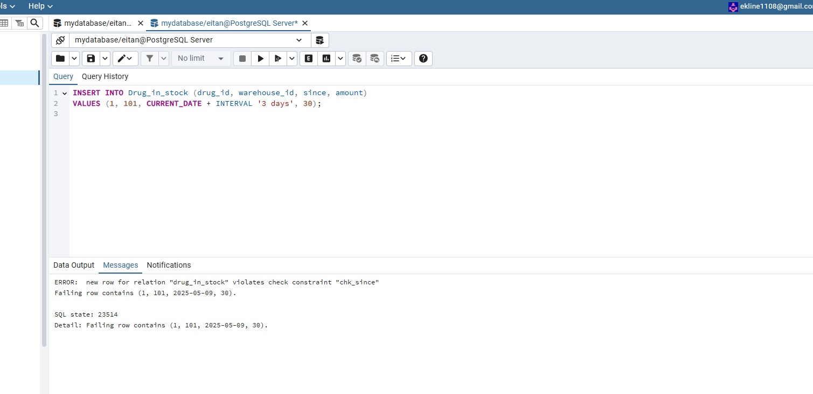

### 2. Drug Order Item Positive Amount (chk_drug_order_item_positive_amount)

**אי אפשר להזמין תרופה בכמות אפס או שלילית.**

שינוי זה נעשה באמצעות פקודת ALTER TABLE על טבלת drug_order_item, שמוסיפה אילוץ CHECK שמוודא שהכמות (amount) היא תמיד מספר חיובי. כאשר מנסים להזמין תרופה בכמות 0 או שלילית, המערכת מחזירה שגיאה.

```sql
ALTER TABLE drug_order_item 
ADD CONSTRAINT chk_drug_order_item_positive_amount CHECK (amount > 0);
```

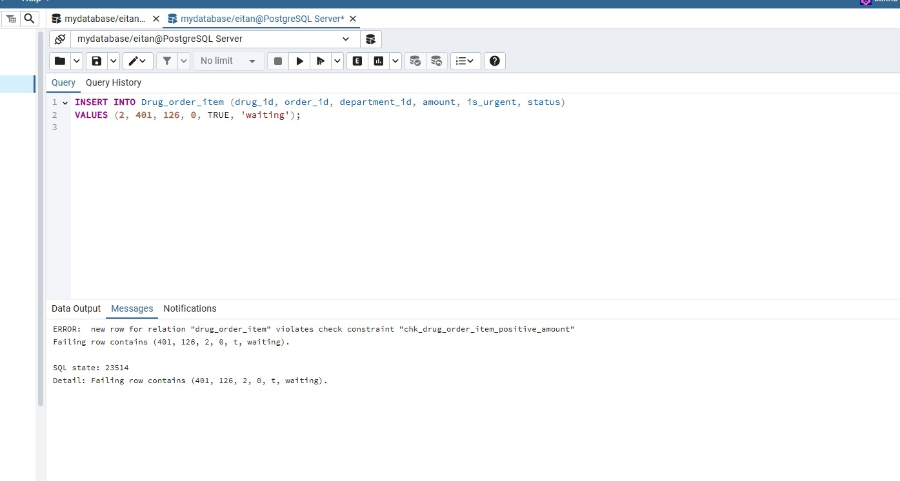

### 3. Equipment Order Item Positive Amount (chk_equipment_order_item_positive_amount)

**אי אפשר להזמין ציוד רפואי בכמות אפס או שלילית.**

שינוי זה נעשה באמצעות פקודת ALTER TABLE על טבלת equipment_order_item, שמוסיפה אילוץ CHECK שמוודא שהכמות (amount) היא תמיד מספר חיובי. כאשר מנסים להזמין ציוד בכמות לא חיובית, המערכת מחזירה שגיאה.

```sql
ALTER TABLE equipment_order_item 
ADD CONSTRAINT chk_equipment_order_item_positive_amount CHECK (amount > 0);
```

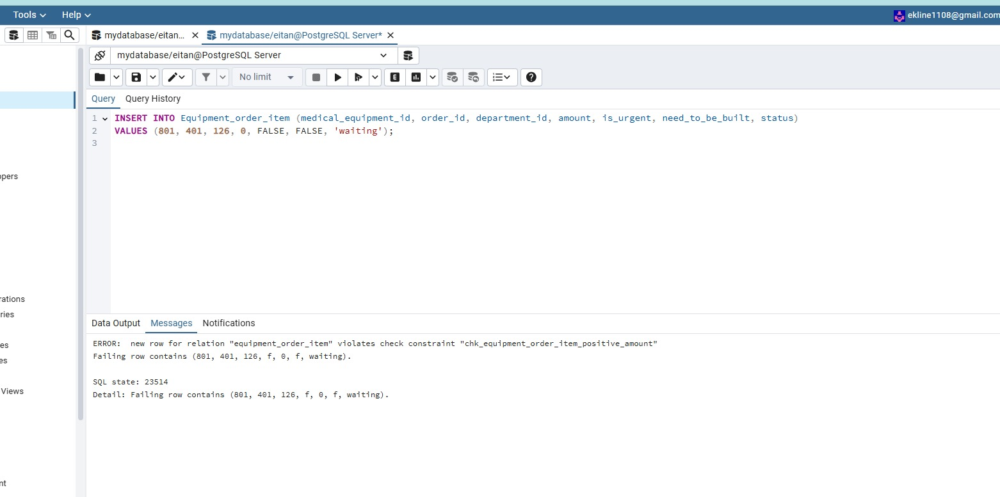

### 4. Default Urgent Drug Flag

**אם לא ציינו האם ההזמנה דחופה – המערכת תניח שהיא לא דחופה כברירת מחדל.**

שינוי זה נעשה באמצעות פקודת ALTER TABLE על טבלת drug_order_item, שמוסיפה ערך ברירת מחדל FALSE לשדה is_urgent. כאשר מכניסים רשומה חדשה ללא ציון ערך לשדה זה, המערכת מגדירה אותו אוטומטית כ-FALSE.

```sql
ALTER TABLE drug_order_item 
ALTER COLUMN is_urgent SET DEFAULT FALSE;
```

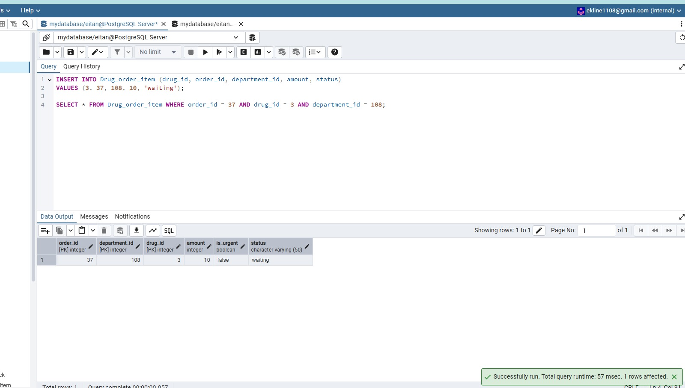

### 5. Default Urgent Equipment Flag

**גם בציוד רפואי – אם לא צוין דחוף, המערכת תניח שההזמנה אינה דחופה.**

שינוי זה נעשה באמצעות פקודת ALTER TABLE על טבלת equipment_order_item, שמוסיפה ערך ברירת מחדל FALSE לשדה is_urgent. כאשר מכניסים רשומה חדשה ללא ציון ערך לשדה זה, המערכת מגדירה אותו אוטומטית כ-FALSE.

```sql
ALTER TABLE equipment_order_item 
ALTER COLUMN is_urgent SET DEFAULT FALSE;
```

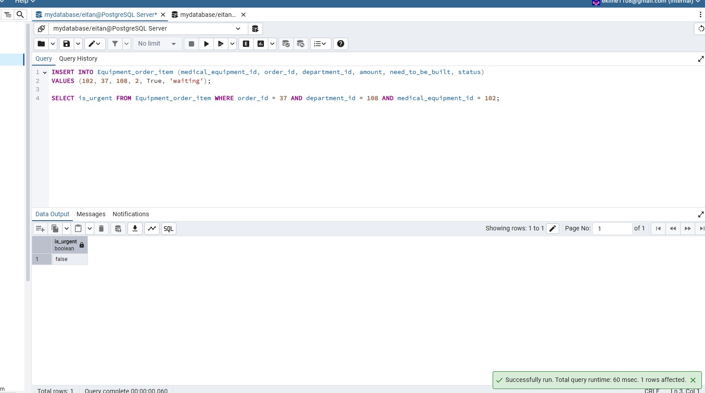

### 6. Not Null Since Date (NOT NULL on since)

**חובה להזין תאריך כניסה (since) לכל תרופה שנכנסת למלאי. בלי זה – אין תוקף ואין מעקב.**

שינוי זה נעשה באמצעות פקודת ALTER TABLE על טבלת drug_in_stock, שמוסיפה אילוץ NOT NULL לשדה since. כאשר מנסים להכניס רשומה ללא תאריך כניסה למלאי, המערכת מחזירה שגיאה ולא מאפשרת את ההכנסה.

```sql
ALTER TABLE drug_in_stock 
ALTER COLUMN since SET NOT NULL;
```

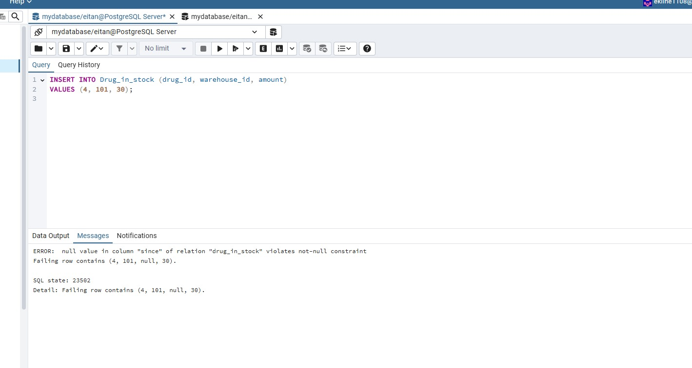

### 2. Drug Order Item Positive Amount (chk_drug_order_item_positive_amount)

**אי אפשר להזמין תרופה בכמות אפס או שלילית.**

שינוי זה נעשה באמצעות פקודת ALTER TABLE על טבלת drug_order_item, שמוסיפה אילוץ CHECK שמוודא שהכמות (amount) היא תמיד מספר חיובי. כאשר מנסים להזמין תרופה בכמות 0 או שלילית, המערכת מחזירה שגיאה.

```sql
ALTER TABLE drug_order_item 
ADD CONSTRAINT chk_drug_order_item_positive_amount CHECK (amount > 0);
```


### 3. Equipment Order Item Positive Amount (chk_equipment_order_item_positive_amount)

**אי אפשר להזמין ציוד רפואי בכמות אפס או שלילית.**

שינוי זה נעשה באמצעות פקודת ALTER TABLE על טבלת equipment_order_item, שמוסיפה אילוץ CHECK שמוודא שהכמות (amount) היא תמיד מספר חיובי. כאשר מנסים להזמין ציוד בכמות לא חיובית, המערכת מחזירה שגיאה.

```sql
ALTER TABLE equipment_order_item 
ADD CONSTRAINT chk_equipment_order_item_positive_amount CHECK (amount > 0);
```


### 4. Default Urgent Drug Flag

**אם לא ציינו האם ההזמנה דחופה – המערכת תניח שהיא לא דחופה כברירת מחדל.**

שינוי זה נעשה באמצעות פקודת ALTER TABLE על טבלת drug_order_item, שמוסיפה ערך ברירת מחדל FALSE לשדה is_urgent. כאשר מכניסים רשומה חדשה ללא ציון ערך לשדה זה, המערכת מגדירה אותו אוטומטית כ-FALSE.

```sql
ALTER TABLE drug_order_item 
ALTER COLUMN is_urgent SET DEFAULT FALSE;
```


### 5. Default Urgent Equipment Flag

**גם בציוד רפואי – אם לא צוין דחוף, המערכת תניח שההזמנה אינה דחופה.**

שינוי זה נעשה באמצעות פקודת ALTER TABLE על טבלת equipment_order_item, שמוסיפה ערך ברירת מחדל FALSE לשדה is_urgent. כאשר מכניסים רשומה חדשה ללא ציון ערך לשדה זה, המערכת מגדירה אותו אוטומטית כ-FALSE.

```sql
ALTER TABLE equipment_order_item 
ALTER COLUMN is_urgent SET DEFAULT FALSE;
```


### 6. Not Null Since Date (NOT NULL on since)

**חובה להזין תאריך כניסה (since) לכל תרופה שנכנסת למלאי. בלי זה – אין תוקף ואין מעקב.**

שינוי זה נעשה באמצעות פקודת ALTER TABLE על טבלת drug_in_stock, שמוסיפה אילוץ NOT NULL לשדה since. כאשר מנסים להכניס רשומה ללא תאריך כניסה למלאי, המערכת מחזירה שגיאה ולא מאפשרת את ההכנסה.

```sql
ALTER TABLE drug_in_stock 
ALTER COLUMN since SET NOT NULL;
```


```sql
ALTER TABLE drug_in_stock 
ADD CONSTRAINT chk_since CHECK (since <= CURRENT_DATE);
```


### 2. Drug Order Item Positive Amount (chk_drug_order_item_positive_amount)

**אי אפשר להזמין תרופה בכמות אפס או שלילית.**

שינוי זה נעשה באמצעות פקודת ALTER TABLE על טבלת drug_order_item, שמוסיפה אילוץ CHECK שמוודא שהכמות (amount) היא תמיד מספר חיובי. כאשר מנסים להזמין תרופה בכמות 0 או שלילית, המערכת מחזירה שגיאה.

```sql
ALTER TABLE drug_order_item 
ADD CONSTRAINT chk_drug_order_item_positive_amount CHECK (amount > 0);
```


### 3. Equipment Order Item Positive Amount (chk_equipment_order_item_positive_amount)

**אי אפשר להזמין ציוד רפואי בכמות אפס או שלילית.**

שינוי זה נעשה באמצעות פקודת ALTER TABLE על טבלת equipment_order_item, שמוסיפה אילוץ CHECK שמוודא שהכמות (amount) היא תמיד מספר חיובי. כאשר מנסים להזמין ציוד בכמות לא חיובית, המערכת מחזירה שגיאה.

```sql
ALTER TABLE equipment_order_item 
ADD CONSTRAINT chk_equipment_order_item_positive_amount CHECK (amount > 0);
```


### 4. Default Urgent Drug Flag

**אם לא ציינו האם ההזמנה דחופה – המערכת תניח שהיא לא דחופה כברירת מחדל.**

שינוי זה נעשה באמצעות פקודת ALTER TABLE על טבלת drug_order_item, שמוסיפה ערך ברירת מחדל FALSE לשדה is_urgent. כאשר מכניסים רשומה חדשה ללא ציון ערך לשדה זה, המערכת מגדירה אותו אוטומטית כ-FALSE.

```sql
ALTER TABLE drug_order_item 
ALTER COLUMN is_urgent SET DEFAULT FALSE;
```


### 5. Default Urgent Equipment Flag

**גם בציוד רפואי – אם לא צוין דחוף, המערכת תניח שההזמנה אינה דחופה.**

שינוי זה נעשה באמצעות פקודת ALTER TABLE על טבלת equipment_order_item, שמוסיפה ערך ברירת מחדל FALSE לשדה is_urgent. כאשר מכניסים רשומה חדשה ללא ציון ערך לשדה זה, המערכת מגדירה אותו אוטומטית כ-FALSE.

```sql
ALTER TABLE equipment_order_item 
ALTER COLUMN is_urgent SET DEFAULT FALSE;
```


### 6. Not Null Since Date (NOT NULL on since)

**חובה להזין תאריך כניסה (since) לכל תרופה שנכנסת למלאי. בלי זה – אין תוקף ואין מעקב.**

שינוי זה נעשה באמצעות פקודת ALTER TABLE על טבלת drug_in_stock, שמוסיפה אילוץ NOT NULL לשדה since. כאשר מנסים להכניס רשומה ללא תאריך כניסה למלאי, המערכת מחזירה שגיאה ולא מאפשרת את ההכנסה.

```sql
ALTER TABLE drug_in_stock 
ALTER COLUMN since SET NOT NULL;
```


## Transaction Management

The hospital logistics system implements transaction management to ensure data integrity during complex operations that involve multiple related tables.

### COMMIT Example

The following example demonstrates a transaction that successfully commits changes to the database:

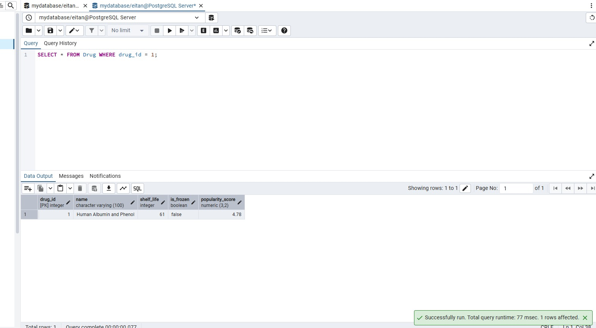

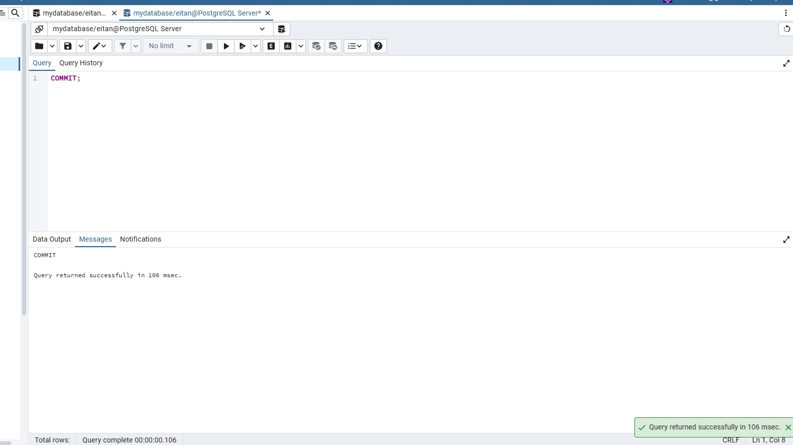

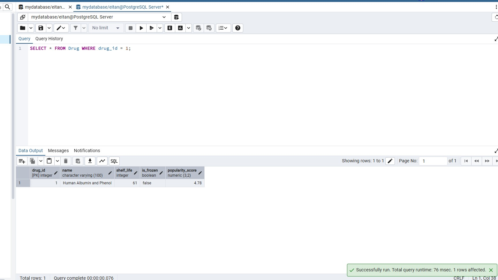

The SQL code for this operation:

```sql
-- Example from ./stage2/RollbackCommit/Commit/CommitingExample.sql
BEGIN;
-- Operations performed within the transaction
UPDATE drug_in_stock SET amount = amount + 50 WHERE drug_id = 1 AND warehouse_id = 1;
-- Additional operations...
COMMIT;
```

### ROLLBACK Example

This example shows a transaction that is rolled back, discarding changes:

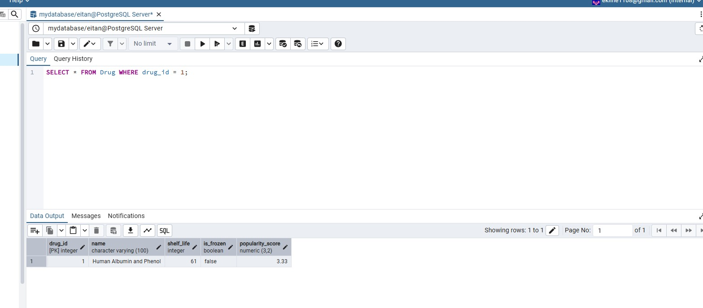

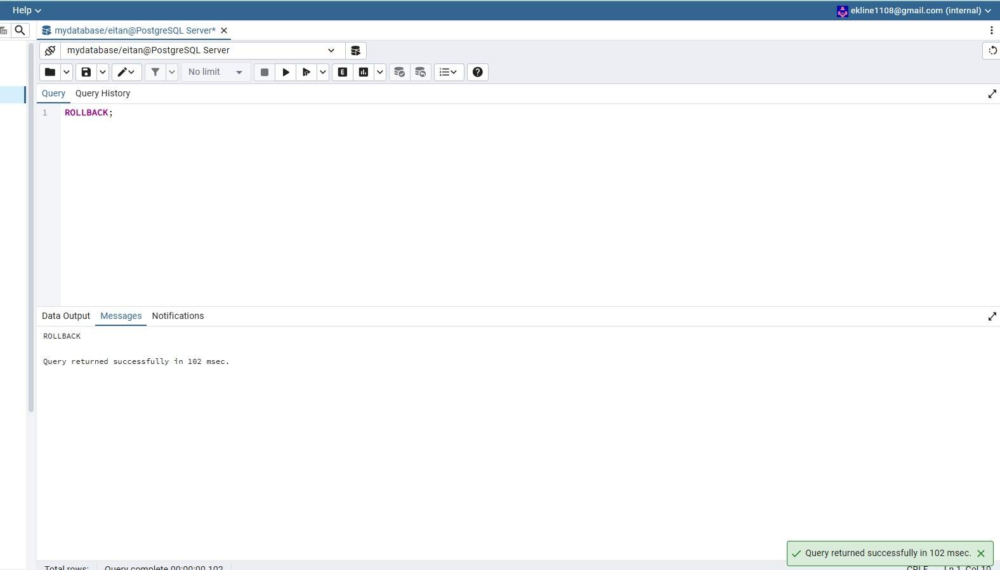

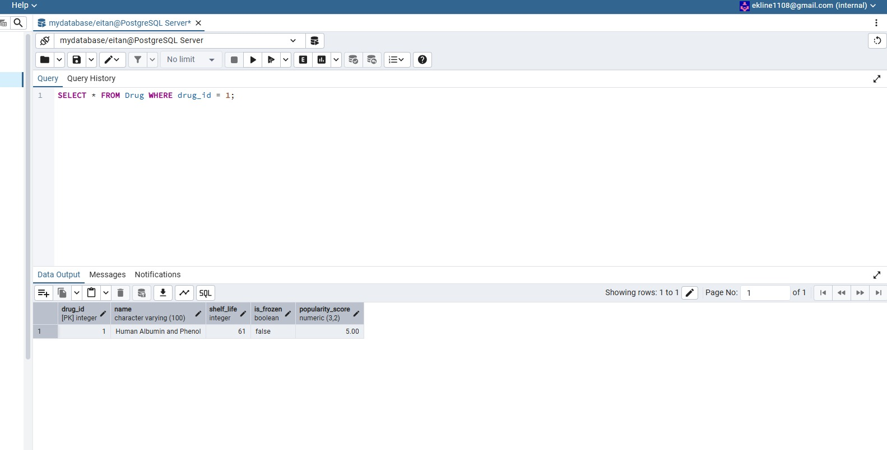

The SQL code for this operation:

```sql
-- Example from ./stage2/RollbackCommit/RollBack/RollingExample.sql
BEGIN;
-- Operations performed within the transaction
UPDATE drug_in_stock SET amount = amount - 30 WHERE drug_id = 1 AND warehouse_id = 1;
-- Due to an error or decision, changes are discarded
ROLLBACK;
```

Transaction management ensures that complex operations affecting multiple tables either complete successfully or have no effect at all, preserving data consistency in the hospital logistics system.
